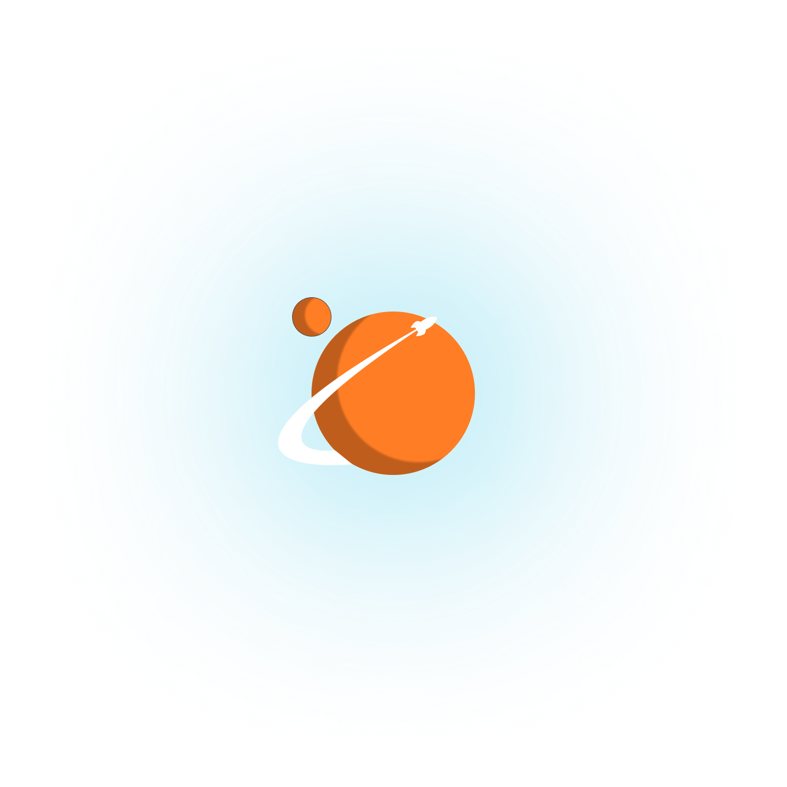
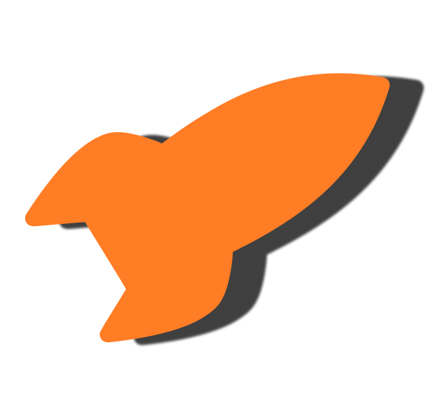

# outer.chat 🚀

<p align="center">
  <a target="blank"></a>
</p>

<p align="center">
  An open-source <strong>Discord-like</strong> alternative. A place to hang-out <em><strong>safely</strong></em> with your friends.
</p>

> [!WARNING]
> This project is still in early developpment.

## Quick look 📸

**outer.chat** is an open-source alternative to Discord, built with NestJS and Prisma. It provides a REST API for standard requests and utilizes WebRTC and Socket.io for real-time communication.

## Features 🎉

- **Real-time communication** : With WebRTC and Socket.io, you can communicate with your friends in real-time.
- **Open-source** : You can contribute to the project and see the code.
- **Self-hosted** : You can host the application on your own server.
- **Customizable** : You can customize the application to match your needs thanks to admin permissions.

## Installation 🧰

### From source

```bash
git clone git@github.com:outer-chat/outer-chat.git --recurse-submodules
cd outer-chat
npm install
```

Now edit the `.env` file to match your configuration. (you can use the [`.env.example`](.env.example) file as an example)
Now you can start the server in developpement mode with :

```bash
npm run start:dev
```

Or in production mode with :

```bash
npm run build
npm run start:prod
```

**Note** : If you do not want to setup a database, you can use the `docker-compose.yml` file at the root of the project. It will launch a postgres database. You can edit the env variables in the `docker-compose.yml` file.

### With Docker

```bash
docker-compose up -d
```

As said earlier, this snippet only up the database. If you want to up the whole stack, you can use the `docker-compose.prod.yml` file at the root of the project.

```bash
docker-compose -f docker-compose.prod.yml up -d
```

As you may, you can edit the env variables in the `docker-compose.prod.yml` file.
And edit the Caddyfile to match your domain.

Note that the `docker-compose.prod.yml` also launch the clientapp. If not already done, I invite you to pull the submodule located in : `./outer-chat.client`.

```bash
git submodule init
git submodule update
```

For any question about the clientapp, please refer to the README of the clientapp.

## Documentation 📑

For end users, you can see the api documentation when the server is started at the `/api` route. (eg. `http://localhost:3000/api`)
For further documentation, (the developer documentation), you can access it in the [docs](docs) folder.

## Running tests 🧪

At the moment, there is only e2e tests. They should cover the major part of the application.

```bash
npm install
npm run test:e2e
```

## Support ❤️

**outer.chat** is an open-source project. You are invited to contribute. You can also support the project by giving a star ⭐️.
The project is still in development, so keep in mind that you can't use it at it full potential yet.

## Contributing

Contributions are welcome. Feel free to open a pull request or an issue.
For the commit naming convention, please stick to the [gitkarma](https://karma-runner.github.io/6.4/dev/git-commit-msg.html) convention.

## License

The code in this repository is released under the GNU AFFERO GENERAL PUBLIC LICENSE, version 3. A copy can be found in the [LICENSE](LICENSE) file.

<p align="center">
  <a target="blank"></a>
</p>
