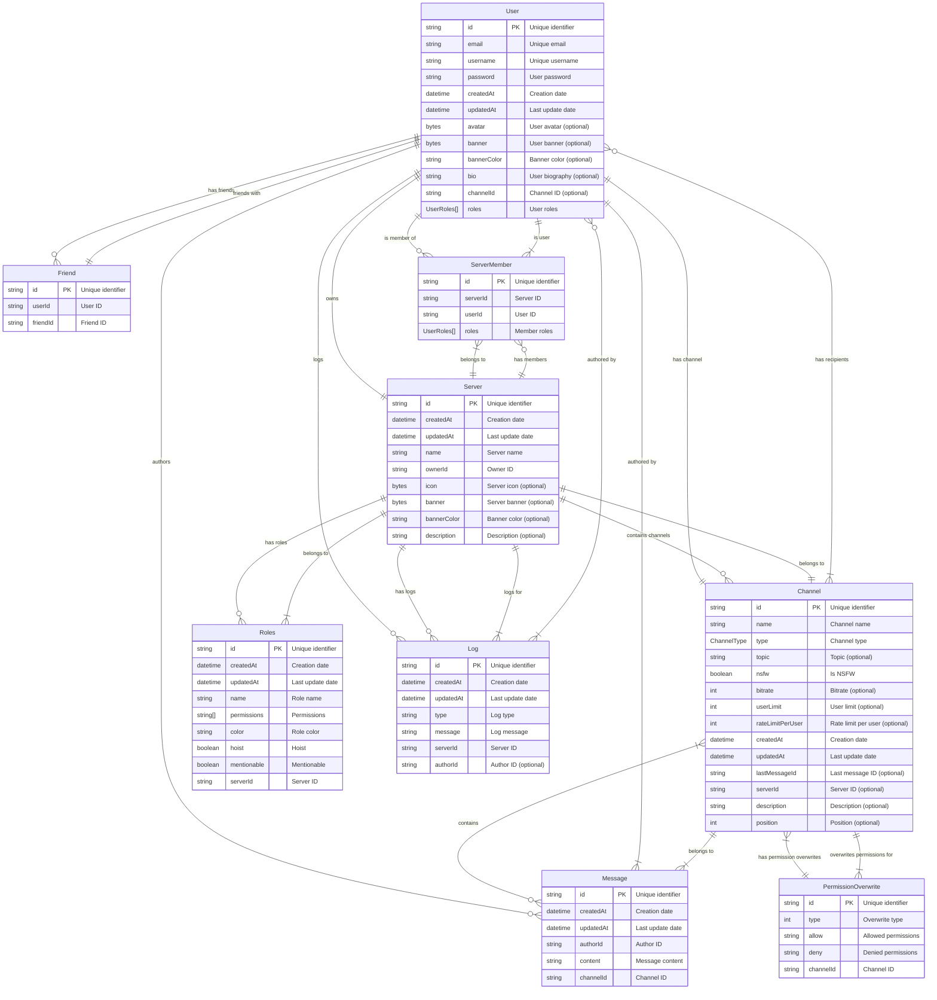

# Developper documentation

- Table of contents
- [Getting started](#getting-started)
- [Database](#database)

## Getting started

## Database

The database is a MongoDb database. You can use the `docker-compose.yml` file at the root of the project to launch a mongo database.
The project use Prisma for the migrations and the database compliance in the Typescipt code.

> [!NOTE]
> You can see the complete schema in [data/database_schema.pdf](data/database_schema.pdf)

There is also a mermaid schema for the database:

